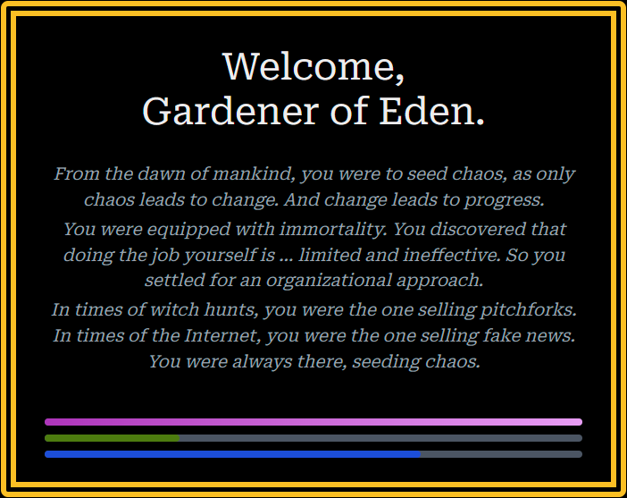

This is a [Next.js](https://nextjs.org) project bootstrapped with [`create-next-app`](https://github.com/vercel/next.js/tree/canary/packages/create-next-app).

# Gardener of Eden

_From the dawn of mankind, you were to seed chaos, as only chaos leads to change. And change leads to progress. You were equipped with immortality. You discovered that doing the job yourself is … limited and ineffective. So you settled for an organizational approach. In times of witch hunts, you were the one selling pitchforks. In times of the Internet, you were the one selling fake news. You were always there, seeding chaos._

In this choice-driven game, you take on the role of the Gardener of Eden. Throughout your journey through the timeline, it is your job to seed chaos while not becoming the target of the public or the establishment yourself.

**Maximize chaos**, while keeping the **favor of people and establishment in balance**. If you lose the favor of either or take their side by maximizing their favor, your **timeline will be terminated**.

The game does not have any religious background, the title is a hommage to [Single Phial by Skyclad](https://soundcloud.com/skycladofficial/single-phial-1), which in turn is a hommage to a movie (which name I do not know) about the name-giving Gardener in Eden.

### Development

**Done in < 3h development time plus ~2h planning and writing for [TriJam 300](https://itch.io/jam/trijam-300).** 
**Team: me :)**

---

### [Play on itch.io](https://kruemelkatze.itch.io/gardener-of-eden)

## Music Attribution

-   Prehistoric: https://freesound.org/people/craigsmith/sounds/675119/
-   Egypt: https://freesound.org/people/szegvari/sounds/609748/
-   Rome: https://freemusicarchive.org/music/Kai_Engel/Calls_and_Echoes/06_-_The_Flames_of_Rome/
-   Medieval: https://freemusicarchive.org/music/maserpan/ambient-soundtracks/medieval-modernity/
-   Plague: https://freesound.org/people/jdpietrzak/sounds/731418/
-   Colonial: https://freesound.org/people/felix.blume/sounds/410357/
-   World War: https://freesound.org/people/paulbogush/sounds/345723/
-   Modern: https://freesound.org/people/G_M_D_THREE/sounds/454649/
-   Cyberpunk: https://freesound.org/people/Wax_vibe/sounds/550332/
-   Space: https://freesound.org/people/Timbre/sounds/124115/

---

